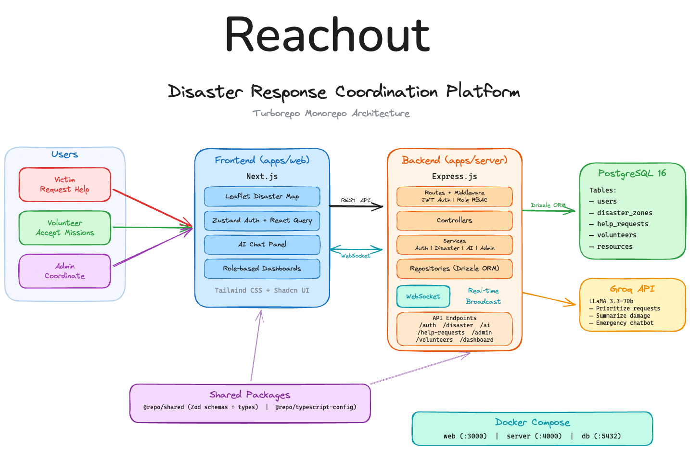

## Prerequisites

- Node.js >= 18
- pnpm 9+
- Docker & Docker Compose (if using Docker setup)

## Setup

### Option 1: Docker Compose

Spins up PostgreSQL, the server, and the web app in one command.

```sh
docker compose up -d
```

- Web: http://localhost:3000
- Server: http://localhost:4000

### Option 2: pnpm (local dev)

1. **Install dependencies**

```sh
pnpm install
```

2. **Set up environment variables**

```sh
cp apps/server/.env.example apps/server/.env
cp apps/web/.env.example apps/web/.env
```

3. **Start a PostgreSQL instance** (you can use the docker compose just for the DB)

```sh
docker compose up db -d
```

4. **Push the schema & run migrations**

```sh
pnpm --filter server db:push
```

5. **Start dev servers**

```sh
pnpm dev
```

## Seed the Database

Seed the database with test data (admin, volunteers, victims, disaster zones, help requests, resources).

**Via API:**

```sh
curl -X POST http://localhost:4000/api/reset-db
```

**Via pnpm:**

```sh
# seed
pnpm --filter server db:seed

# clear all data
pnpm --filter server db:clear
```

## Architecture


